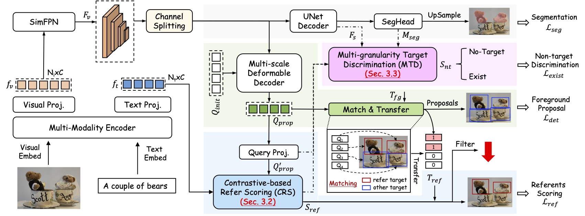

# PropVG: End-to-End Proposal-Driven Visual Grounding with Multi-Granularity Discrimination

## Updates

- **2025.09.05: The codes and models are released.**
- **2025.06.26: Our work has been accepted by ICCV 2025.**

## Abstract
Recent advances in visual grounding have largely shifted away from traditional proposal-based two-stage frameworks due to their inefficiency and high computational complexity, favoring end-to-end direct reference paradigms. However, these methods rely exclusively on the referred target for supervision, overlooking the potential benefits of prominent prospective targets. Moreover, existing approaches often fail to incorporate multi-granularity discrimination, which is crucial for robust object identification in complex scenarios. To address these limitations, we propose PropVG, an end-to-end proposal-based framework that, to the best of our knowledge, is the first to seamlessly integrate foreground object proposal generation with referential object comprehension without requiring additional detectors. Furthermore, we introduce a Contrastive-based Refer Scoring (CRS) module, which employs contrastive learning at both sentence and word levels to enhance the model’s capability in understanding and distinguishing referred objects. Additionally, we design a Multi-granularity Target Discrimination (MTD) module that fuses object- and semantic-level information to improve the recognition of absent targets. Extensive experiments on gRefCOCO (GREC/GRES), Ref-ZOM, R-RefCOCO/+/g, and RefCOCO/+/g (REC/RES) benchmarks demonstrate the effectiveness of PropVG.

## FrameWork
 

## Installation
CUDA=11.8
torch=2.0.0
torchvision=0.15.1

### Prerequisites

```bash
pip install -r requirements.txt
```

Our code depends on parts of [detrex](https://detrex.readthedocs.io/en/latest/tutorials/Installation.html) and [detectron2](https://github.com/facebookresearch/detectron2), so you need to install and compile them.
```
python -m pip install 'git+https://github.com/facebookresearch/detectron2.git'
git clone https://github.com/IDEA-Research/detrex.git
cd detrex
git submodule init
git submodule update
pip install -e .
```

Then install PropVG package in editable mode:
```bash
pip install -e .
```


### Data Preparation

Prepare the mscoco dataset, then download the referring annotations and foreground annotations in [Models Zoo](###models-zoo).

The data structure should look like the following:
```
| -- data
    |--seqtr_type
        | -- annotations
            | -- refcoco-unc
                | -- instances_withid.json
            | -- refcocoplus-unc
                | -- instances_withid.json
            | -- refcocog-umd
                | -- instances_withid.json
            | -- mixed-seg
                | -- instances_nogoogle_withid.json
                | -- coco_all.json
            | -- grefs
                | -- instance.json
                | -- coco_annotations.json
            | -- ref-zom
                | -- instances_withid.json
                | -- allobj.json
            | -- rrefcoco
                | -- instances_withid.json
                | -- allobj.json

        | -- images
            | -- mscoco
                | -- train2014
```

### Pre-trained Weights

`PropVG` utilizes the [BEiT-3](https://github.com/microsoft/unilm/blob/master/beit3/README.md) model as both the backbone and the multi-modality fusion module. The pre-trained weights can be downloaded from [this link](https://github.com/microsoft/unilm/blob/master/beit3/README.md#download-checkpoints). Additionally, you will need to download the [tokenizer](https://github.com/microsoft/unilm/blob/master/beit3/README.md#text-tokenizer) for BEiT-3.

First, create a directory for the pre-trained weights:
 
```
mkdir pretrain_weights
```
Place the BEiT checkpoints and tokenizer within this directory.

```
pretrain_weights
|—— beit3_base_patch16_224.zip
└── beit3.spm
```


The final directory structure of PropVG should resemble the following:
```
PropVG
├── asserts
├── configs
├── data
├── pretrain_weights
├── propvg
└── tools
```

## Demo

Here, demo for PropVG are provided.

The following scripts can be used to test on the GRES task.
```bash
python tools/demo.py --img "asserts/imgs/Figure_1.jpg"  --expression "three skateboard guys" --config  "configs/gres/PropVG-grefcoco.py"  --checkpoint  /PATH/TO/PropVG-grefcoco.pth --img_size 320
```

The following scripts can be used to test on the RIS task.
```bash
python tools/demo.py --img "asserts/imgs/Figure_2.jpg"  --expression "full half fruit" --config  "configs/refcoco/PropVG-refcoco-mix.py"  --checkpoint  /PATH/TO/PropVG-refcoco-mix.pth --img_size 384
```

For loading alternative pretrained weights or adjusting threshold settings, please consult the `tools/demo.py`.


## Training

If you want to retrain the model, you can run the following scripts:
```bash
bash tools/dist_train.sh [PATH_TO_CONFIG] [GPU_NUMBER]
```


## Evaluation

If you want to reproduce the result, download it and then run the following scripts:
```bash
bash tools/dist_test.sh [PATH_TO_CONFIG] [GPU_NUMBER] --load-from [PATH_TO_CHECKPOINT_FILE]
```

### Models ZOO

We release the checkpoint and dataset annotation in the huggingface. [CHECKPOINTS](https://huggingface.co/Dmmm997/PropVG), [DATASET](https://huggingface.co/datasets/Dmmm997/PropVG-Data)

| Train Set | Checkpoint|  Referring  Annotations |  Foreground Annotations |
| --------- | --------- | ----------------------- |  ---------------------  |
| RefCOCO   | PropVG-refcoco.pth | instances_withid.json | coco_all.json |
| RefCOCO+  | PropVG-refcoco+.pth | instances_withid.json | coco_all.json |
| RefCOCOg  | PropVG-refcocog.pth | instances_withid.json | coco_all.json |
| RefCOCO-mix  | PropVG-refcoco-mix.pth | instances_nogoogle_withid.json | coco_all.json |
| gRefCOCO  | PropVG-grefcoco.py | instances_withid.json | coco_annotations.json |
| Ref-ZOM  | PropVG-refzom.pth | instances_withid.json | allobj.json |
| RRefCOCO  | PropVG-rrefcoco.pth | instances_withid.json | allobj.json |


Reproduce the RefCOCO result using this script:
```bash
bash tools/dist_test.sh configs/refcoco/PropVG-refcoco.py 1 --load-from /PATH/TO/PropVG-refcoco.pth --MTD_K 250
```

Reproduce the RefCOCO+ result using this script:
```bash
bash tools/dist_test.sh configs/refcoco/PropVG-refcoco+.py 1 --load-from /PATH/TO/PropVG-refcoco+.pth --MTD_K 250
```

Reproduce the RefCOCOg result using this script:
```bash
bash tools/dist_test.sh configs/refcoco/PropVG-refcocog.py 1 --load-from /PATH/TO/PropVG-refcoco.pth --MTD_K 250
```

Reproduce the RefCOCO-Mix result using this script:
```bash
bash tools/dist_test.sh configs/refcoco/PropVG-refcoco-mix.py 1 --load-from /PATH/TO/PropVG-refcoco-mix.pth --score-threshold 0.7 --MTD_K 250
```

Reproduce the gRefCOCO result using this script:
```bash
bash tools/dist_test.sh configs/gres/PropVG-grefcoco.py 1 --load-from /PATH/TO/PropVG-grefcoco.pth  --score-threshold 0.7 --MTD_K 250
```

Reproduce the Ref-ZOM result using this script:
```bash
bash tools/dist_test.sh configs/refzom/PropVG-refzom.py 1 --load-from /PATH/TO/PropVG-refzom.pth --score-threshold 0.7 --MTD_K 100
```

Reproduce the RRefCOCO result using this script:
```bash
bash tools/dist_test.sh configs/rrefcoco/PropVG-rrefcoco.py 1 --load-from /PATH/TO/PropVG-rrefcoco.pth  --score-threshold 0.7 --MTD_K 100
```


### Acknowledge
This repository partially builds upon the codebases of [SimVG](https://github.com/Dmmm1997/SimVG/), [BEiT-3](https://github.com/microsoft/unilm/tree/master/beit3) and [SeqTR](https://github.com/seanzhuh/SeqTR).

## Citation
```
@misc{propvg,
      title={PropVG: End-to-End Proposal-Driven Visual Grounding with Multi-Granularity Discrimination}, 
      author={Ming Dai and Wenxuan Cheng and Jiedong Zhuang and Jiang-jiang Liu and Hongshen Zhao and Zhenhua Feng and Wankou Yang},
      year={2025},
      eprint={2509.04833},
      archivePrefix={arXiv},
      primaryClass={cs.CV},
      url={https://arxiv.org/abs/2509.04833}, 
}
```

